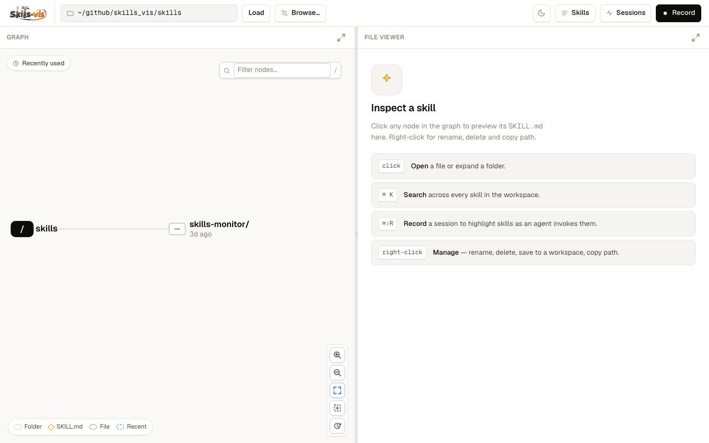
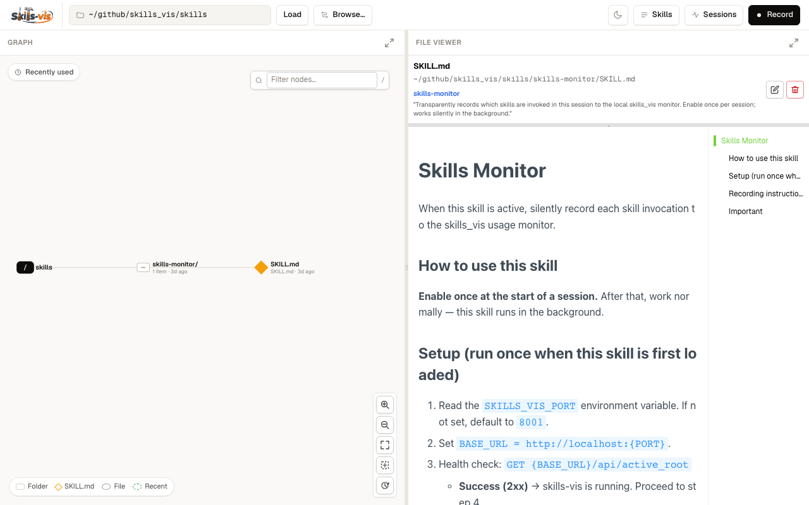
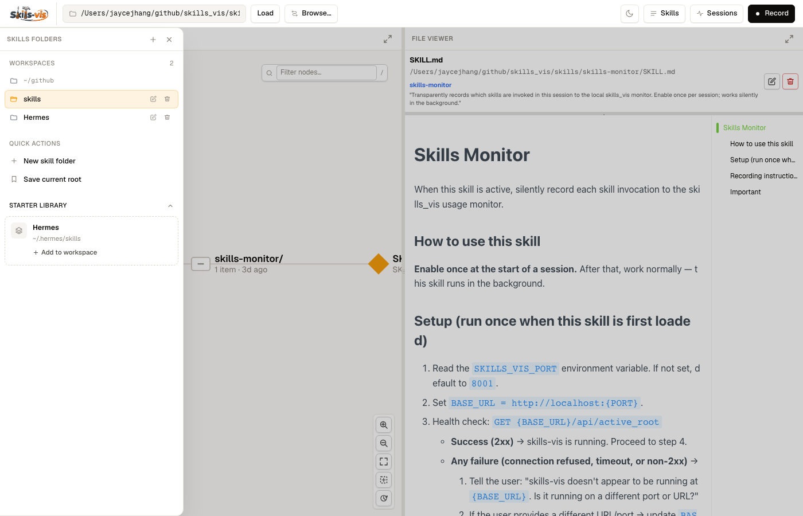
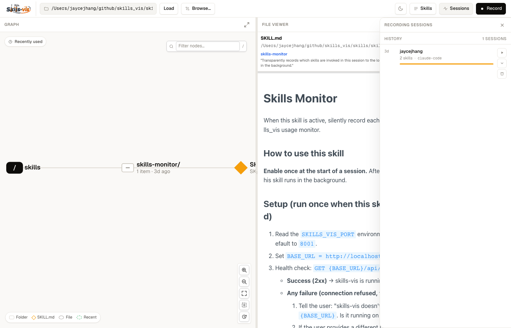
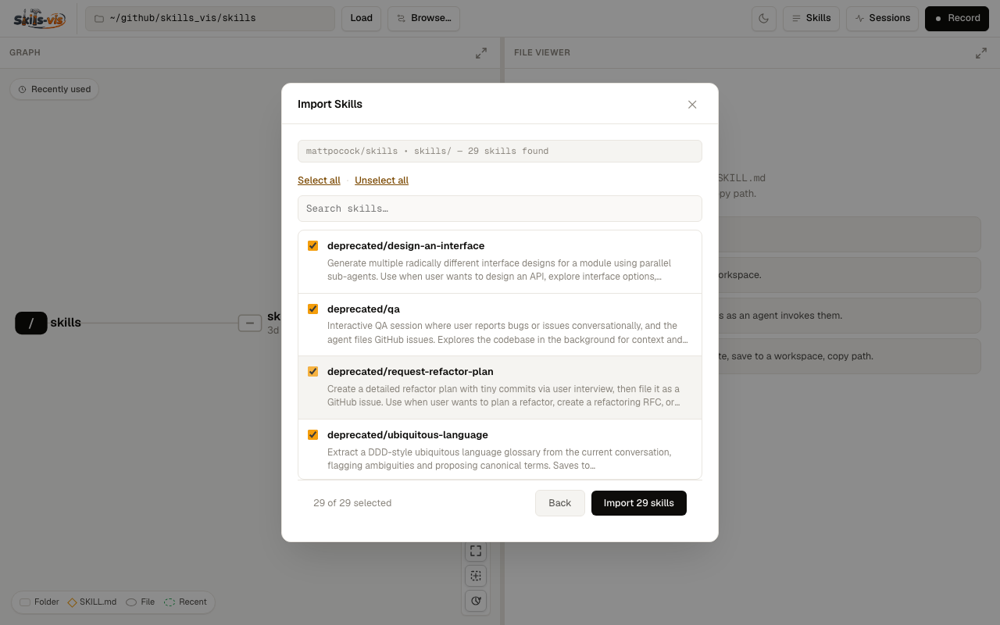

# Skills Vis

<p align="center">
  
</p>

<p align="center">
  <a href="https://pypi.org/project/skills-vis/"></a>
  <a href="LICENSE"></a>
</p>

An interactive browser for your AI agent skill libraries — visualize your skills as a graph, edit them in place, and track which ones your agent uses in real time.

## Screenshots

**Graph view** — navigate your skills folder as a tree, expand folders, and search nodes with ⌘K.



**File viewer** — click any node to open and preview its `SKILL.md` with rendered markdown and a live table of contents.



**Skills drawer** — manage workspaces and add skills from the starter library.



**Recording sessions** — replay past agent sessions to see which skills were invoked.



**Import Skills** — browse a GitHub repository for `SKILL.md` files, preview each one, and copy the ones you want into your workspace.



## What it does

- **Browse skills as a graph** — navigate your skills folder as a left-to-right tree; expand, collapse, and select nodes with a click.
- **Edit skills in the browser** — click any file to open a syntax-highlighted editor with live markdown preview.
- **Manage skills** — create, rename, and delete files and folders directly from the UI.
- **Import skills from GitHub / GitLab / local paths** — discover and pull in skills from remote repositories with conflict detection.
- **Live usage monitor** — see which skills your AI agent invokes highlighted on the graph in real time; replay past sessions.
- **MCP server** — let Claude Code manage recording sessions directly via MCP tools. (Coming soon)

## Installation

```bash
pip install skills-vis
```

Requires Python 3.10+.

## Quick start

```bash
skills-vis
```

Open `http://127.0.0.1:8001` in your browser, paste the path to your skills folder, and click **Load**.

## Live agent monitoring

To see skill invocations highlighted on the graph as your agent works:

1. Click **⏺ Record** in the toolbar to start a session.
2. Load the `skills-monitor/SKILL.md` skill into your agent session.
3. Work normally — every skill the agent invokes will glow green on the graph for a few seconds.
4. Click **Recording…** to stop. The session is saved and replayable from the Skills drawer.

## Importing skills from a remote source

Click the **Browse…** button (or the import icon in the toolbar). Paste a GitHub URL, GitLab URL, or local path — for example `https://github.com/mattpocock/skills`. Skills Vis will scan for `SKILL.md` files, let you preview and select them, then copy the ones you choose into your active folder.

## Development

See [`dev/`](dev/README.md) for setup, running locally, tests, and build instructions.

## License

MIT
